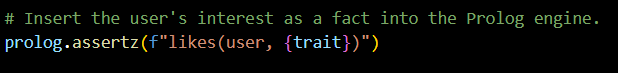
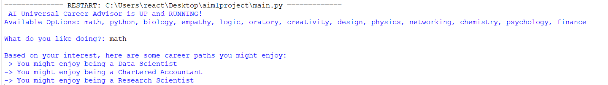
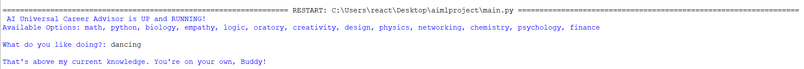
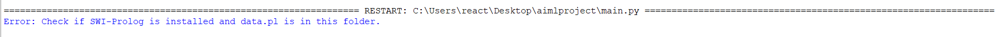

**AI Career Advisor**

***1. Project Overview***

This project is a Knowledge-Based Expert System designed to help students map their personal interests to various career paths. It addresses the real-world problem of career confusion by using Symbolic AI to provide logical recommendations.

The system is built using a **Hybrid Architecture**:


**Prolog:** Acts as the "**Inference Engine**", storing facts and logical rules.


**Python**: Acts as the "**Intelligent Agent**" interface, handling user input and communicating with the logic brain.

***2. Course Relevance***

This project directly implements several Course Outcomes from the Fundamentals in AI and ML syllabus:


* Demonstrates the structure of an Intelligent Agent and the application of Search Strategies.


* Provides a practical implementation of Prolog Programming, including facts, rules, unification, and dynamic databases.

***3. Features***

* **Multi-Domain Knowledge:** Covers careers in CSE, Medicine, Law, Arts, and Business.


* **Dynamic Learning:** Uses assertz to add user preferences to the knowledge base at runtime.



***4. Setup & Installation***

To run this project, you must install the following:

* **Step 1:** Install SWI-Prolog.
The core logic engine requires SWI-Prolog.

   Download it from [swi-prolog.org](https://www.swi-prolog.org/)

> ***Crucial:*** ***During installation on Windows, check the box "Add swipl to the system PATH".***

* **Step 2:** Install Python Dependencies.
Install the pyswip bridge library via terminal:

```
pip install pyswip
```
***5. How to Use***

> Ensure *main.py* and *data.pl* are in the same folder.

Run the program:

```
python main.py
```
Enter a trait when prompted (e.g., logic, biology, or design).

The AI will query the Prolog brain and display all matching career paths.

***6. Project Structure***

* **advisor.pl:** The Knowledge Base containing Predicates and Rules.

* **main.py:** The Python script managing the user interface and the pyswip bridge.

***7. Results:***


When entered trait is present in data


When entered trait is not in domain


When Knowledge base is missing
